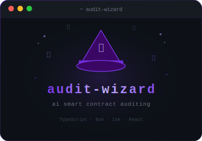

# AuditWizard AI Auditing Agent

<p align="center">
  
</p>

<p align="center">
  
  
  
</p>

<p align="center">
  <a href="#what-is-audit-wizard">What is AuditWizard</a> |
  <a href="#how-to-install">Install</a> |
  <a href="#how-to-run">Run</a>
</p>

## What is AuditWizard

Audit Wizard (2.0) is an open-source initiative to solve the gaps of the auditor/agent interface layer during security audits of Ethereum protocols.

Ethereum security auditors are at a crucial transition point:

Attacker capabilities grow exponentially with AI
Protocols’ understanding of their own code decreases exponentially
Contests and bug bounties are becoming less efficient (AI submissions make triage harder)
Responsible protocols still pay for 1–2 audits pre-launch, but auditor reliance on AI (for code interaction, summarization, learning protocols, etc.) is increasing - risking less knowledgeable future auditors

Our goal is to use deep expertise in Ethereum security tooling and AI to shape the human-to-agent interface and standardize this shift—ensuring the ratio of auditors to attackers becomes favorable.

> [!NOTE]
> We are working in public and releasing this at a very early stage. please check back for our progress, see high level items below

- [x] secure skills loading to run guardrails and safety check on AI skills
- [x] baked-in recommended AI auditing skills
- [x] agent messaging system for cross-execution
- [x] claude models support (bring your own API key)
- [ ] hot-reloaded TUI environment to code audit-wizard as you go
- [x] context management, compaction, costs tracking
- [x] easy context window reset
- [x] cron job for recurring tasks
- [ ] audit contests tracking and management
- [ ] baked-in poc reproduction
- [ ] easy standalone binary distribution
- [ ] VPS infrastructure for collaborative work 

## How to install

### From source

```bash
git clone https://github.com/auditware/audit-wizard.git
cd audit-wizard
bun install
```

## How to run

### Simple

```bash
bun run src/cli.tsx
```

<br>

Start or resume a named session

```bash
bun run src/cli.tsx --session main
```

<br>

Resume the last session

```bash
bun run src/cli.tsx --resume
```

<br>

Build a standalone binary

```bash
bun run build
./dist/audit-wizard
```

## Built-in Skills

AuditWizard ships with a curated set of security-focused skills. Load any of them with the `/skills` command or the `a` keybinding.

| Skill | Description | Author |
|---|---|---|
| `smart-contract-audit` | Comprehensive multi-expert audit framework for Solidity/Vyper, Anchor Rust, TON, and Move | [@forefy](https://github.com/forefy) |
| `solidity-auditor` | Live security review of Solidity contracts as you develop | [@pashov](https://github.com/pashov) |
| `x-ray` | Pre-audit readiness report: threat model, invariants, integrations, test coverage, git history | [@pashov](https://github.com/pashov) |
| `audit-prep` | Structured protocol onboarding and audit preparation checklist | [@PlamenTSV](https://github.com/PlamenTSV) |
| `audit-extractor` | Extract findings from PDF audit reports into a markdown checklist | [@Layr-Labs](https://github.com/Layr-Labs) |
| `auditor-quiz` | Interactive knowledge quiz to test auditor understanding of a codebase | [@forefy](https://github.com/forefy) |
| `blockchain-forensics` | On-chain forensics and transaction tracing for incident response | [@forefy](https://github.com/forefy) |
| `dimensional-analysis` | Annotate arithmetic with units/dimensions to catch formula and scaling bugs | [@trailofbits](https://github.com/trailofbits) |

## Requirements

- [Bun](https://bun.sh) >= 1.3
- An Anthropic API key (set via `/api-key` or `ANTHROPIC_API_KEY` env var)